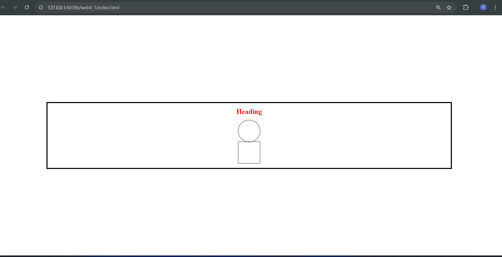

# web4_1
# web4_1
# Shape Layout Using HTML and CSS

This project demonstrates a simple webpage layout created using HTML and CSS. It includes a heading and two connected shapes (a circle and a square) aligned vertically, with some basic styling.

## Preview



## Features

- A red heading at the top.
- A circle and square connected, centered in the middle of the page.
- Responsive layout that centers content both horizontally and vertically on the page.
- Simple, clean design with basic CSS styles.

## How to Use

1. Clone the repository to your local machine:
    ```bash
    git clone https://github.com/your-username/your-repo-name.git
    ```
   
2. Navigate to the project directory:
    ```bash
    cd your-repo-name
    ```

3. Open `index.html` in your preferred browser to see the layout.

## Files

- **index.html**: Contains the HTML structure for the webpage.
- **styles.css**: Contains the CSS styles for the webpage.
- **layout_preview.png**: A preview image of the layout (optional).

## Customization

Feel free to modify the HTML or CSS to customize the design further. You can:
- Change the shape sizes by adjusting the `width` and `height` properties in the CSS.
- Modify the color of the heading or border of the shapes.
- Add more shapes or text elements to expand the layout.

## License

This project is open source and available under the [MIT License](LICENSE).
